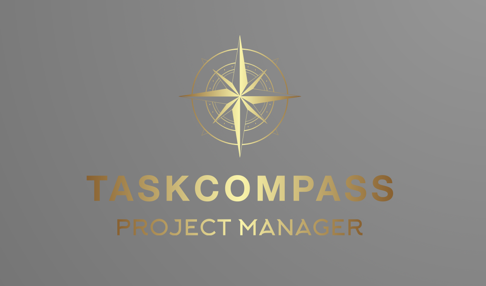

<p align="center">
  
</p>

# Alpha Solutions Project Calculation Tool

The Alpha Solutions Project Calculation Tool is a project management tool designed to help project managers estimate task breakdown, time breakdown, and schedules involved in completing a project. It provides users with the ability to create clients for a project, search for clients, create subtasks for a more detailed overview of the project, create and assign teams to specific subtasks, put specific time on a sub-task, and take into account limitations for completing the task. The tool also enables users to edit and delete clients, projects, and teams.

## Motivation

The motivation behind creating the Alpha Solutions Project Calculation Tool was to provide project managers with an effective tool for managing and estimating the time and resources required to complete a project. The tool was created to simplify the task of estimating time and resource requirements and to enable project managers to efficiently manage their projects.

## Accessing Project

To use the Alpha Solutions Project Calculation Tool, follow these steps:

1. **Accessing the Calculation tool**
   - Visit [Taskcompass project manager](https://task-compass.onrender.com) to access the web app.

2. **Logging in**
   - To log in, please use the following test client credentials:

      ```sql
      INSERT INTO taskcompass.Client (client_name, contact_po_no, contact_person, company_po_no, address, zip_code, country) VALUES
        ('ABC Inc.', 11111111, 'John Smith', 99999999, '123 Main St.', 3400, 'DK'),
        ('XYZ Ltd.', 22222222, 'Jane Doe', 88888888, '456 Maple Ave.', 2950, 'DK'),
        ('PQR Co.', 33333333, 'Bob Johnson', 77777777, '789 Oak St.', 3450, 'DK');
      ```

## Creating Clients and Managing Projects

To efficiently manage your projects using the Alpha Solutions Project Calculation Tool, follow these guidelines:

1. **Creating Clients and Managing Projects**
   - Click on the "Create Client" button to initiate the client creation process.
   - Fill in the necessary details, including client name, contact information, company PO number, address, zip code, and country.
   - Once a client is created, you gain the ability to search for clients and effectively manage project-related information associated with them.

2. **Working with Subtasks and Teams**
   - Enhance task management by creating subtasks within each project, facilitating a detailed breakdown of tasks and accurate time estimation.
   - Improve organization and resource allocation by assigning teams to specific subtasks.
   - Provide the required information and follow the on-screen prompts to seamlessly manage subtasks and teams associated with your projects.

3. **Editing and Deleting Data**
   - Maintain control over your project's information by utilizing the provided interface to edit or delete clients, projects, and teams as needed.
   - Make any necessary changes or updates to keep your project data accurate and up to date.

By following these steps, you can effectively create clients, manage projects, work with subtasks and teams, and make necessary edits or deletions. The Alpha Solutions Project Calculation Tool empowers you to streamline your project management process.

## Tech/Framework Used

The Alpha Solutions Project Calculation Tool was built using the following technologies and frameworks:

- GitHub
- Meta Platform Messenger
- Monday.com
- Google Drive
- LucidChart
- Render.com
- Microsoft Teams
- IntelliJ IDEA
- MySQL Desktop
- Microsoft OneNote

## Features

The Alpha Solutions Project Calculation Tool includes the following features:

- Client creation and search
- Subtask creation and assignment
- Team creation and assignment
- Time breakdown and limitation consideration
- Edit and delete functionality for clients, projects, and teams

## Contact Information

For any inquiries, questions, or contributions related to the Alpha Solutions Project Calculation Tool, please feel free to reach out to us:

- [Naja Egede Moe](https://github.com/najamoe)
- [Mathilde Trend](https://github.com/MathildeTrendy)
- [Sabrina Ebbesen](https://github.com/sabr5840)

We welcome any feedback, suggestions, bug reports, or collaboration opportunities. Please don't hesitate to get in touch with us.
